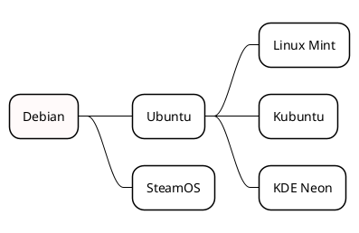

---
title:
    Apuntes
date: 16/06/2021
export_on_save:
    puppeteer: true
    html: true
puppeteer:
    scale: 1
    landscape: false
    format: "A4"
    printBackground: true
    margin:
        top: "1cm"
        right: "1cm"
        bottom: "2.5cm"
        left: "1cm"
    displayHeaderFooter: true
    headerTemplate: "&nbsp;"
    footerTemplate: "
    <span style=\"font-size: 9pt; display: flex;\">
        <span class=\"pageNumber\" style=\"margin-left: 1cm;\"></span>
        /
        <span class=\"totalPages\"></span>
        <span class=\"title\" style=\"margin-left: 1cm;\"></span>
        <span style=\"margin-left: 1cm;\">Juanjo Guarinos</span>
    </span>
    "
toc:
    depth_from: 1
    depth_to: 5
    ordered: false
---

@import "EstilosPersonalizadosMarkdownEnhanced.less"

# Apuntes {ignore=true}

[Descargar estos apuntes](./apuntes.pdf)

## Índice {ignore=true}

[TOC]

<div style=\"page-break-after:always;\"></div>

## Introducción

### Desventajas :-1: 

* :x: Hacer maquetaciones complejas es '*costoso*'.
* :x: Requiere del manejo de varias herramientas y tecnologías.
* :x: Requiere de una estructura inicial '*compleja*'.
* :x: Tiene poco sentido si no se va a generar documentación técnica o se va a trabajar de forma individualizada.
* :x: Documentación '*pobre*' ne ocasiones.

### Vantajas :+1: 

* :heavy_check_mark: **Ideal para trabajo en equipo** o en grupo.
* :heavy_check_mark: Homogeneidad en la generación de contenido.
* :heavy_check_mark: Historial y revisión de cambios integrado.
* :heavy_check_mark: **Automatización** en la generación de documentos y despliegue.
* :heavy_check_mark: Permite bifurcaciones.
* :heavy_check_mark: Permite familiarizarse con tecnologías como MarkDown y Git (GitHub) para después aplicarlas con los alumnos en proyectos de grupo o transversales.

<div style="page-break-after:always;"></div>

## Pre-Requisitos

1. Tener una **cuenta de GitHub** (Especial para profesores)

    > :pushpin: **Nota:** Se puede utilizar Azure DevOps pero esta opción no se ha explorado en profundidad y posiblemente precise de extensiones diferentes de VSCode.

2. Tener instalado **Google Chrome** en el equipo.
3. Tener instalado **[Git](https://git-scm.com/download/win)**
4. Tener el Java Runtime instalado.
5. Tener instalado **[Visual Studio Code](https://code.visualstudio.com/)**.

    Se recomienda asociar un perfil de VSCode con la cuenta de GitHub y añadir las siguiente extensiones:
    * Markdown All In One. (Permite editar documentos markdown de forma simple).
    * Markdown Preview Enhanced
    * Spanish - Code Spell Checker
    * Git Extension Pack
    * Otras:

      * Visual Studio Keymap (O el que prefieras)
      * TODO Highlight
      * GitHub Pull Requests and Issues
      * GitHub Actions
      * Convert to Markdown Table.
      * markdownlint.

<div style="page-break-after:always;"></div>

## Trabajo básico con markdown

La extensión markdownlint te ayuda ha escribir markdown normalizado, pero como estamos usando una extensión, no es es muy importante salvo respetar los saltos de línea.

En **`cheatsheet_markdown.pdf`** dispones de las extensiones apropiadas.

También puedes consultar la documentación oficial en la [Página de Markdown Preview Enhanced](https://shd101wyy.github.io/markdown-preview-enhanced/#/)

> :hand: **Importante:**
> 
> En la carpeta **`.vscode/`** se han pre-definido varios code snippets (fragmentos de código) en en fichero **`FragmentosPernosalizados.code-snippets`**
> Para usarlos, una vez abierto un fichero con extensión markdown escribiremos **`mde_`** seguido de **`Ctrl + Space`** que es el (trigger suggestions) en mi KeyMap.

### Elementos especiales

Funciones matemáticas en línea $f(x) = x^2+3$

Con display en bloque:

$$f(x) = x^2+3$$

Código indicando el lenguaje a renderizar:

```txt
    ```csharp
    string AYUDA = "csharp{.line-numbers} para numerar las líneas." +
                "csharp{highlight=2} para resaltar la línea 2" +
                "csharp{highlight=[2,5-7]} para resaltar la 2 y de la 5 a la 7" +
                "csharp{highlight=1; .line-numbers} para hacer ambas cosas";
    ```
```
```csharp
    string AYUDA = "csharp{.line-numbers} para numerar las líneas." +
                "csharp{highlight=2} para resaltar la línea 2" +
                "csharp{highlight=[2,5-7]} para resaltar la 2 y de la 5 a la 7" +
                "csharp{highlight=1; .line-numbers} para hacer ambas cosas";
```

Diagramas de Graphviz, PlantUML, Mermaid, etc.

```txt
    ```puml {align="center", style="zoom:1"}
    @startmindmap
    <style>
    mindmapDiagram {
        Linecolor black
        FontName Arial
        FontSize 14
        node {
                Padding 15
                Margin 15
                HorizontalAlignment center
                BackGroundColor white
            }
    }
    </style>

    *[#snow] Debian
    ** Ubuntu
    *** Linux Mint
    *** Kubuntu
    *** KDE Neon
    ** SteamOS

    @endmindmap
    ```
```




<div style="page-break-after:always;"></div>

Uso directo de HTML embebido con estilos definidos en el fichero importado justo después del frontmatter denominado **`EstilosPersonalizadosMarkdownEnhanced.less`**. Se puede utilizar para maquetaciones complejas.

```html
<div class="contenedor">
    <div class="fondo">
        <div class="abre_comilla">"</div>
        <div class="cierra_comilla">"</div>
        <div class="cita">Esto es una cita.</div>
        <div class="autor">- Aquí va el autor.</div>
    </div>
</div>
```

<div class="contenedor">
    <div class="fondo">
        <div class="abre_comilla">"</div>
        <div class="cierra_comilla">"</div>
        <div class="cita">Esto es una cita.</div>
        <div class="autor">- Aquí va el autor.</div>
    </div>
</div>

Importar código **renderizado al vuelo** a gráfico vectorial.

```txt
@import "assets/linux_kernel.dot" {align="center", style="zoom:0.4"}
```

@import "assets/linux_kernel.dot" {align="center", style="zoom:0.4"}

<div style="page-break-after:always;"></div>

## Flujo de trabajo y configuraciones

1. Trabajar en una rama con nuestro nombre y asegurarnos que trabajamos en ella.
2. (Opcional) Arrastrar el issue a la columna In Progress del Kanban.
3. Al finalizar la sesión:

   ```cmd
   git add . 
   git commit -m "mensaje"
   git push
   ```

4. Aquí puedo volver al punto 2 y seguir trabajando en el issue.
5. Al finalizar mi trabajo, inicio el proceso de Revisión/Integración.

   1. Ejecutar este Wroflow (está en **`posible_workflow_github.cmd`**).

        ```cmd
        git fetch origin
        git merge origin/main
        git push

        git checkout main
        git merge MI_RAMA
        git push
        git checkout MI_RAMA
        ```

   2. Crear un **Pull Request** al revisor/a/es.
      * Se solicitará de la rama con mi nombre sobre el Main o de mi fork sobre el repositorio original.
      * Se asignará revisor/a/es.
      * Una vez esté revisado 'mergeado' el pull request en la rama principal cerrar el issue y arrastrarlo a la columna Done del Kanban (opcional).

   3. Si solo queremos actualizarnos a como esté el main

        ```cmd
        git checkout main
        git pull
        git checkout MI_RAMA
        git merge main
        ```

   4. Una vez se ejecute el push en la rama main de GitHub se desencadenan las siguientes acciones en **`.github\workflows\publicar_web_action.yaml`**

        ```yaml
        name: PublicaWeb

        # Al hacerse Push en master
        on:
        push:
            branches: [ master ]

        # Ejecuta este workflow secuencial (otro job se ejecutaría en paralelo)
        jobs:
        # Solo hay un trabajo llamado publica
        publica:
            # Se ejecuta en una máquina de ubuntu
            runs-on: ubuntu-latest

            # Secuencia de pasos
            steps:
            # Hace un un checkout del espacio de trabajo actual ($GITHUB_WORKSPACE) 
            # y después un checkout a la rama master
            - uses: actions/checkout@v2

            # Ejecuta esta lista de comando en un bash de ubuntu donde ...
            # Creo una carpeta a publicar en www eliminando carpetas vacías y 
            # solo las extensiones indicadas en rsync_files.txt
            # Posteriormente elimino carpetas que no quiero que se publiquen
            - name: Crea carpeta a publicar en www
                run: |
                rsync -av --prune-empty-dirs --include-from=rsync_files.txt ./ www/
                rm -Rv www/Examenes
                rm -Rv www/Proyectos
                rm -Rv www/Bibliografía

            # Publico en la rama main del repositorio donde tengo 
            # github pages activado el contenido sincronizado en www ...
            - name: Despliego www en el repo donde tengo github pages activado
                uses: peaceiris/actions-gh-pages@v3
                with:
                personal_token: ${{ secrets.DEPLOY_GH_KEY }}
                external_repository: nombre del repositorio sin https
                publish_branch: main
                publish_dir: ./www
                allow_empty_commit: true
        ```

        Contenido de **`rsync_files.txt`** para que se publique solo lo necesario.

        ```txt
         + */
         + *.html
         + *.pdf
         + *.png
         + *.jpeg
         + *.jpg
         + *_ejemplo.cs
         + *_caso_de_estudio.zip
         + *.svg
         - *
        ```

        > :pushpin: **Nota:**
        > 
        > Para configurar **`secrets.DEPLOY_GH_KEY`**
        > 1. Ir a https://github.com/settings/tokens y crear un token de acceso a tus repositorios.
        > 2. Ir al repositorio de trabajo https://URLDeTuRepo/settings/secrets/actions y añadir un secreto llamado **`DEPLOY_GH_KEY`** con el token generado en el paso 1.


